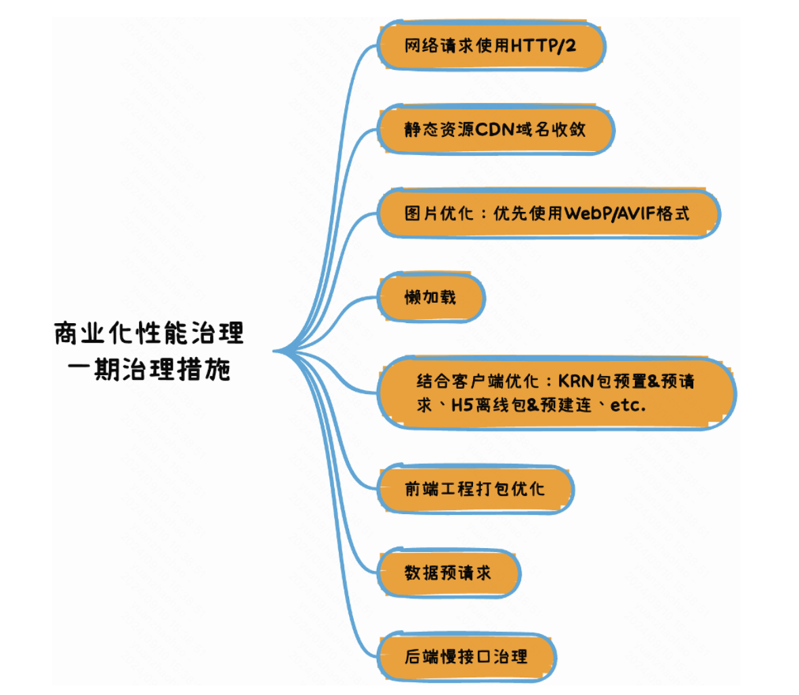

#### babel-loader 替换为builtin:swc-loader 加快打包速度和编译速度
#### biome 替换 eslint(代码rules检查工具) prettier(代码格式化工具) 加快检查和格式化的速度基于rust
#### lightingcss 不能和css预处理器一起使用 处理css的解析 转换 压缩 和打包 项目中主要用来替换post-css loader 进行css语法降级 和添加浏览器前缀等
~~~ts
lightningcss 作为css 压缩器 指定browserslist 减少构建之后的polyfill
// webpack.config.js
const CssMinimizerPlugin = require('css-minimizer-webpack-plugin');
const lightningcss = require('lightningcss');
const browserslist = require('browserslist');

module.exports = {
  optimization: {
    minimize: true,
    minimizer: [
      new CssMinimizerPlugin({
        minify: CssMinimizerPlugin.lightningCssMinify,
        minimizerOptions: {
          targets: lightningcss.browserslistToTargets(browserslist('>= 0.25%'))
        },
      }),
    ],
  },
};
~~~
#### css预处理器使用 sass-loader和 sass-embded处理 sass-embedded 是 Sass 原生 Dart 可执行文件的 JavaScript wrapper

#### js代码压缩使用  更快的SWC minimizer，SwcJsMinimizerRspackPlugin插件。

#### css 代码压缩使用 Lightning CSS minimizer，即LightningCssMinimizerRspackPlugin  插件

#### webpack include exclude 缩小loader 和编译范围

#### prefetch preload 预获取prefetch 和预加载 preload  添加到link标签里面 针对脚本和css样式 
##### preload：提高资源加载优先级。适用于提前加载字体，加载语言包等场景，prefetch：降低资源加载优先级，在下载闲置时再下载缓存起来。适用于提高下一个页面使用该资源缓存以提高加载速度的场景 ，所以通过这两种方式资源的加载都不会阻塞关键渲染路径；
预加载字体
```ts
<link rel="preload" href="ComicSans.woff2" as="font" type="font/woff2" crossorigin>
```
预加载样式
```ts
<link rel="preload" href="style.css" as="style" />
```
预加载script js 文件
```ts
<head>
  <link rel="preload" as="script" href="critical.js">
</head>
```
预加载video 视频 文件
```ts
  <link rel="preload" href="sintel-short.mp4" as="video" type="video/mp4" />
```


#### async defer 异步加载脚本 async 无序(加载的脚步最好没有和其他的脚本js文件有依赖关系)  defer 有序 两者的加载过程都不会阻塞html的解析过程 前者加载完之后立即执行会阻塞html的解析过程 后者加载完之后等html解析完毕之后再执行。

#### script 标签一般放body 底部 如果要放在头部的话  需要在头部加上async defer 属性。

#### dns-prefetch 提前针对某些域名做dns解析 一般和preconnect 一起使用
```ts
<link rel="dns-prefetch" href="https://fonts.googleapis.com/" />

<link rel="preconnect" href="https://fonts.googleapis.com/" crossorigin />
<link rel="dns-prefetch" href="https://fonts.googleapis.com/" />

```


#### 图片文件减少体积 压缩图片 使用webp  avif apng 等体积小分辨率高的格式图片

#### 首屏异步加载  或者懒加载 懒加载组件 懒加载图片等 React.lazy import('...')等 

#### 资源gzip 压缩

#### 减少重绘和回流 减少频繁的dom操作  使用DocumentFragment 批量进行dom操作 

#### 尽量使用CSS3的动画功能来渲染界面 利用浏览器的合成层 使用webgpu的能力 并发渲染 使用 will-change 属性

#### React或者Vue 路由级别的懒加载 

#### web worker 将计算比较大的任务移除到主线程外



## 如何减少构建体积

#### webpack externals排除掉某些第三方依赖单独打包

#### 项目中某些大的依赖使用更小的包替换

#### 静态资源css img 上cdn 走缓存 同时减少本地打包资源体积

#### 去除项目中没有使用到的依赖和减少重复依赖

#### 按需引入polyfill 
```ts
export default {
  output: {
    polyfill: 'usage',
  },
};
```

#### 一些公共依赖通过运行时的机制去加载 ，减少最终的产物体积 如使用MF2.0 的运行时加载机制实现减少构建产物的体积。

#### webpack 分包机制 splitChunk  机制
```ts
//简易demo
  optimization: {
    splitChunks: {
      // include all types of chunks
      chunks: 'all',
    },
  },
```
#### 具体一点的分包demo case
```ts
    splitChunks: {
    cacheGroups: {
        vendor: {
        test: /[\\/]node_modules[\\/]/,
        name: 'vendors',
        chunks: 'all',
        },
    },
    },
```
#### 使用支持 Tree-Shaking 的库，对无引用的库或函数进行删除，如 lodash -> lodash/es

#### 对无法 Tree Shaking 的库，进行按需引入模块，如使用 import Button from 'antd/lib/Button'，此处可手写 babel-plugin 自动完成，但不推荐

#### es module 的 tree shaking 机制 减少无用代码的打包构建

#### 压缩css 和 js代码  减少产物体积

#### 首屏含有视频对于视频的 一些优化  https://web.developers.google.cn/articles/lazy-loading-video?hl=zh-cn preload 延迟加载  或者采用iframe loading lazy 方式 延迟加载iframe 内容


